# Harnath
A simple android app for the mathematics department of my college (or any other college that has same syllabus).
It helps students to get the study resources and know their teachers, track their study, and define goals for themeselves and  collaborate on goals effectively.

  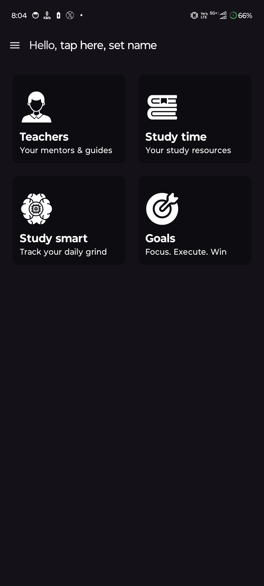

## ✨ Features

### Teachers Section
- Browse the list pf parmanent teachers from the department.
- View their details and areas of experties.

### Study Resources
- Access semester-wise resources.
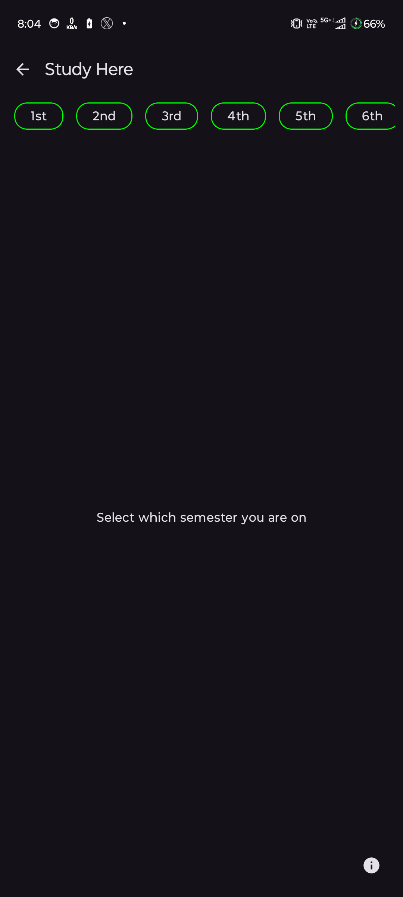

### Study Smart
- Create subjects and organize tasks for them.
- Start study session with a **study timer**.
- Track progress with saved tasks and sessions.

  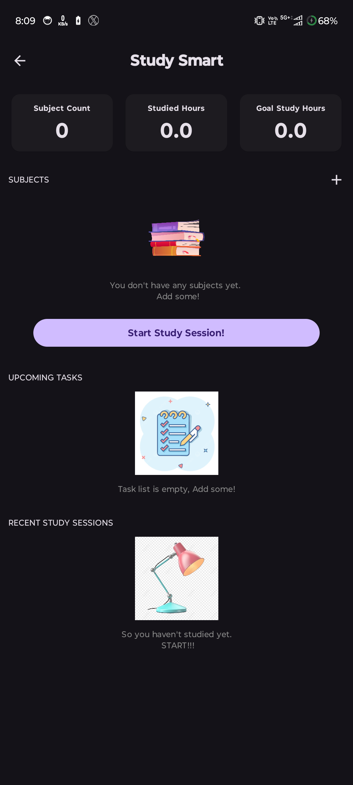
  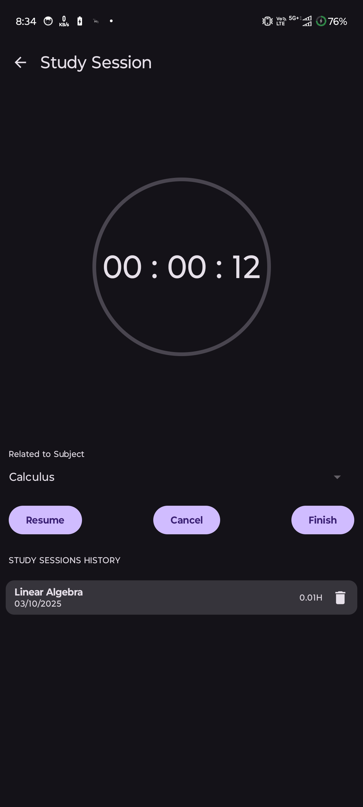

### Goals Section
- Define **personal goals** with deadline.
- Create **shared goals** with teammates.
- Discuss and collaborate on shared goals in real-time chat.

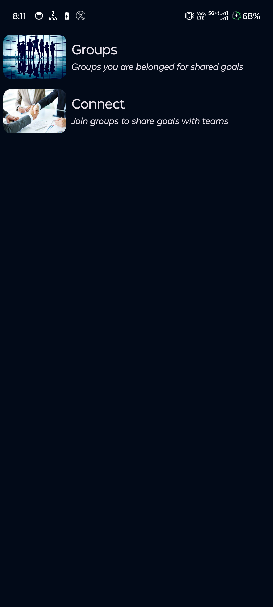

## 🛠️ Tech Stack
- **Kotlin** + **Jetpack Compose** for UI
- **Firebase Realtime Database** for sharing study material, teachers details and live discussions
- **Room Database** for Local storage
- **Supabase** for Goals

## 📷 Some more Screen Shots

  
  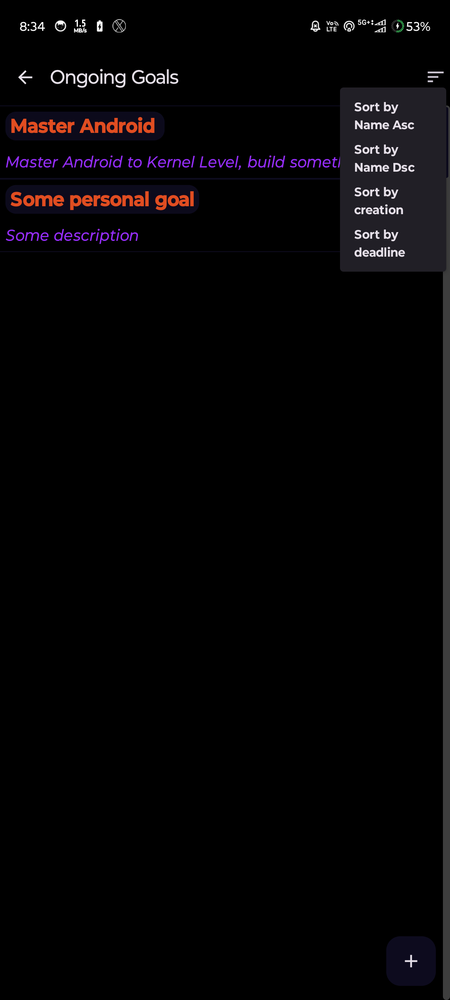
  
  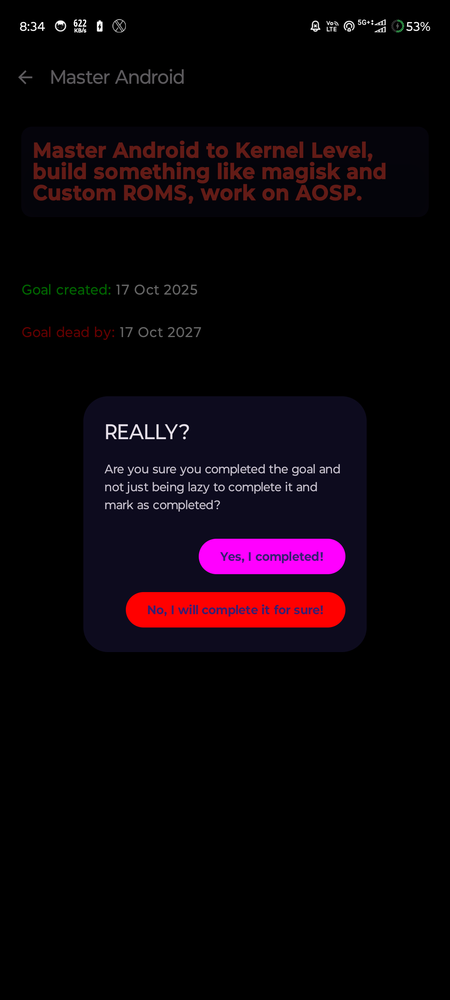
  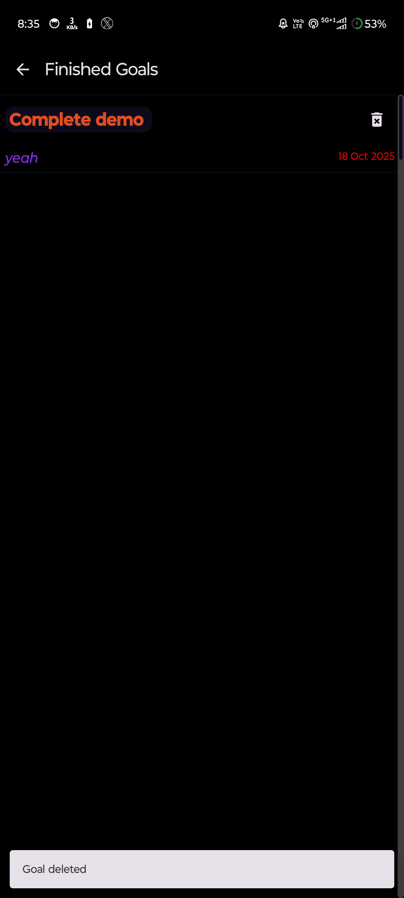
  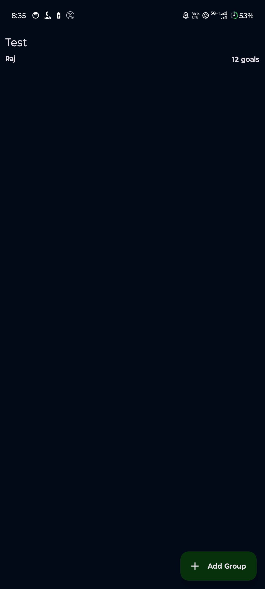
  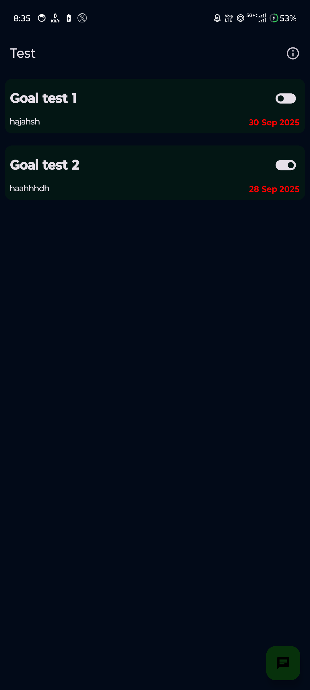
  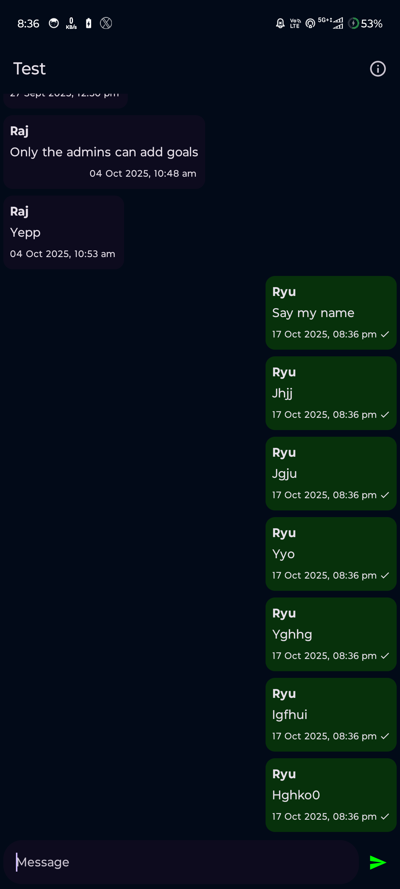
  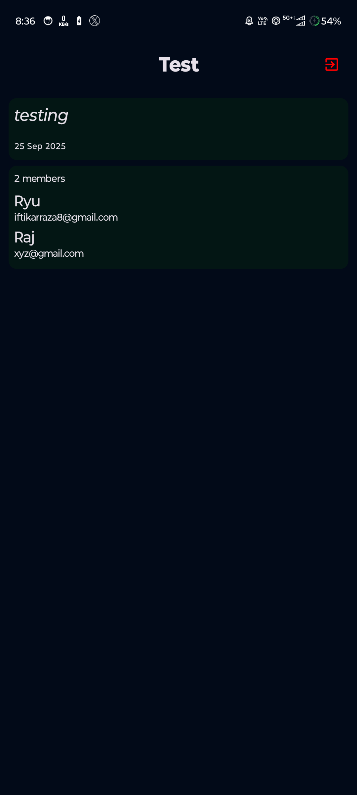
  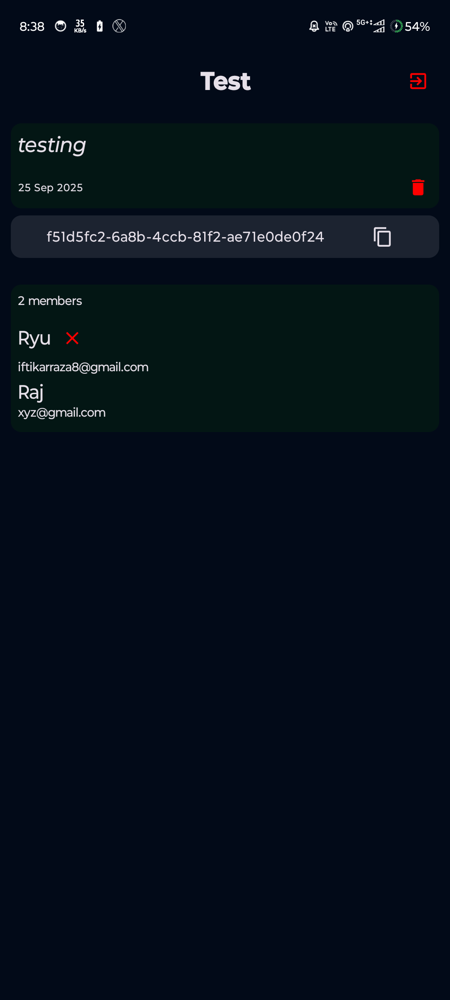
  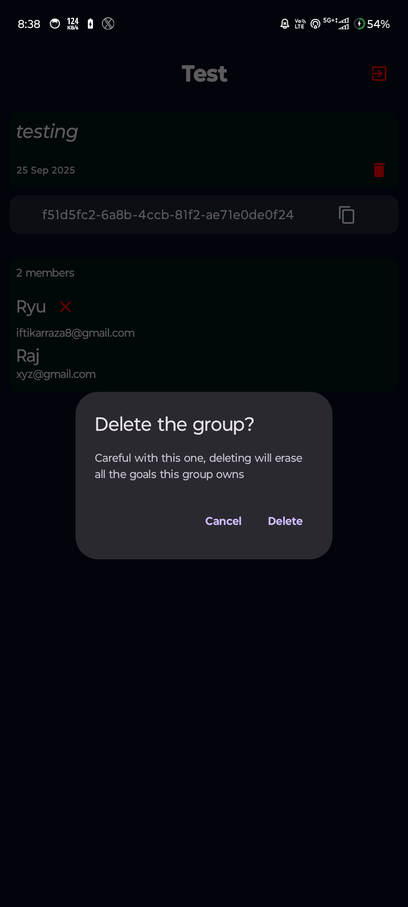
  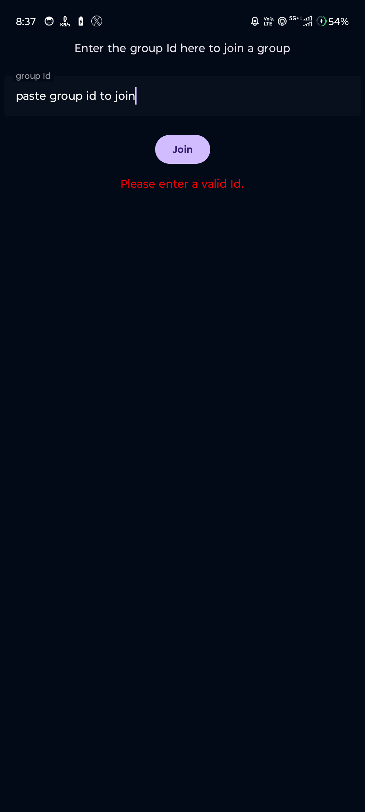
  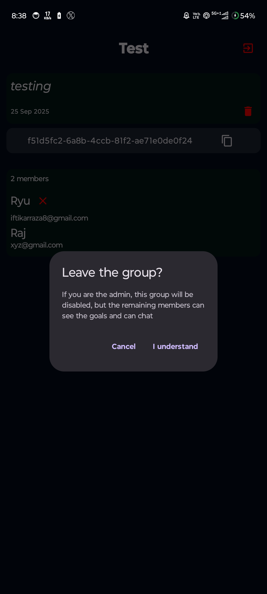
  
  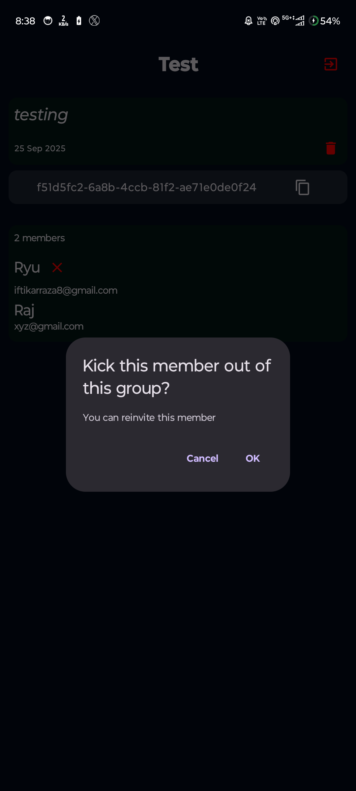
  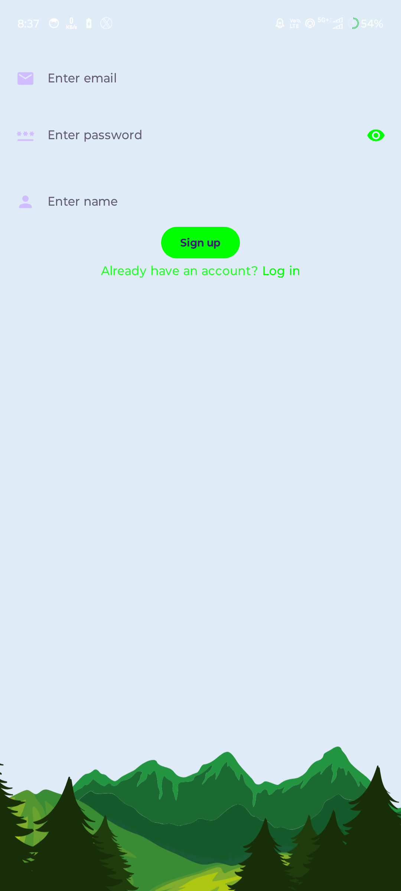
  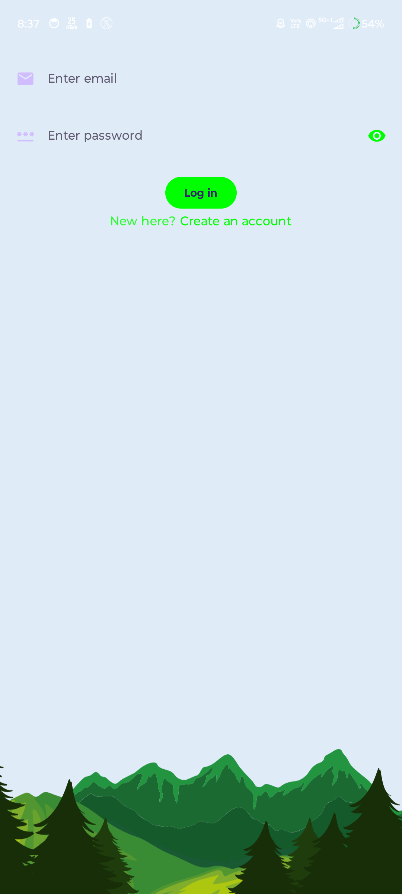
  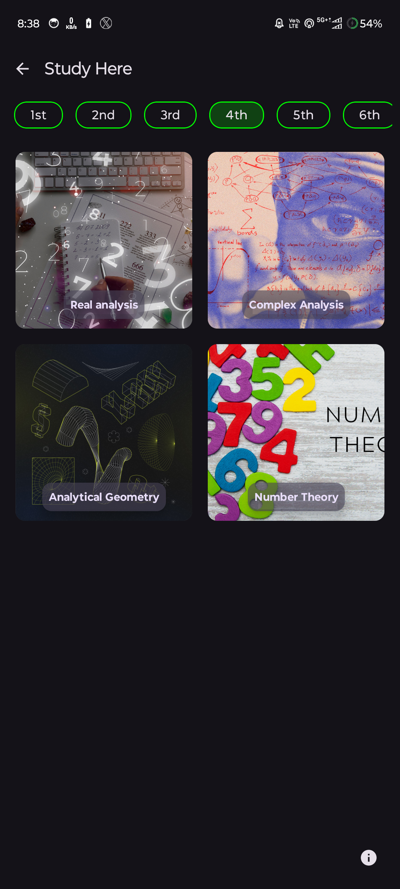
  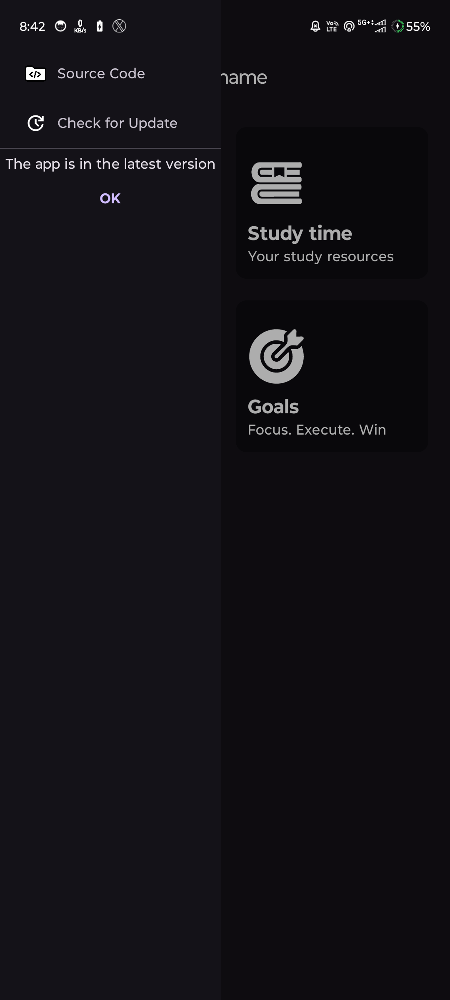

